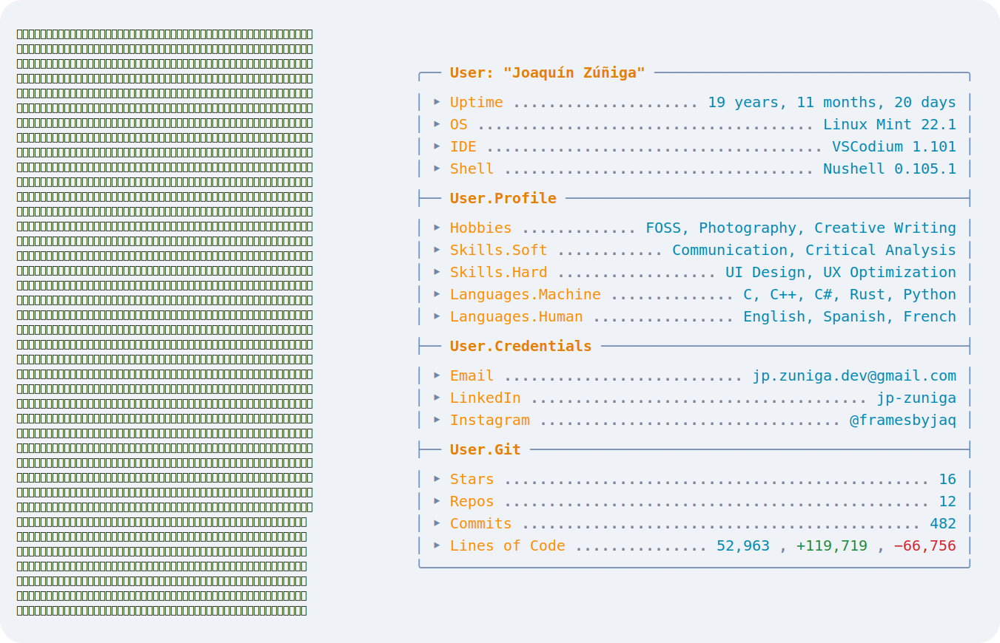

<picture>
    <source media="(prefers-color-scheme: dark)" srcset="./updater/assets/dark_mode.svg">
    <source media="(prefers-color-scheme: light)" srcset="./updater/assets/light_mode.svg">
    
</picture>
